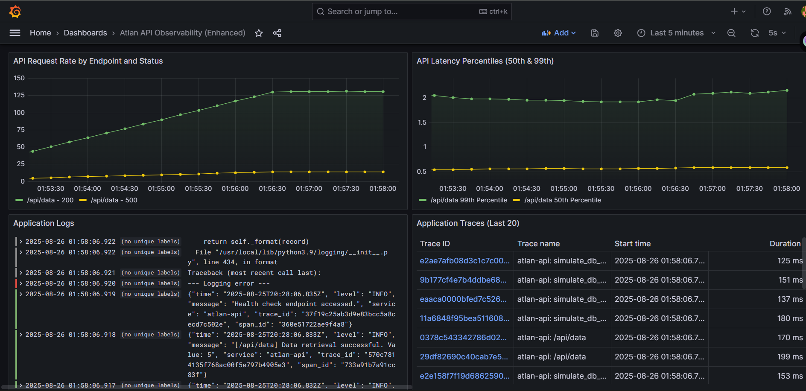
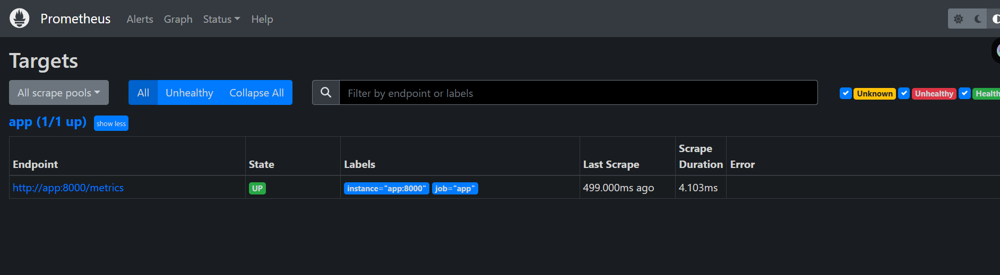
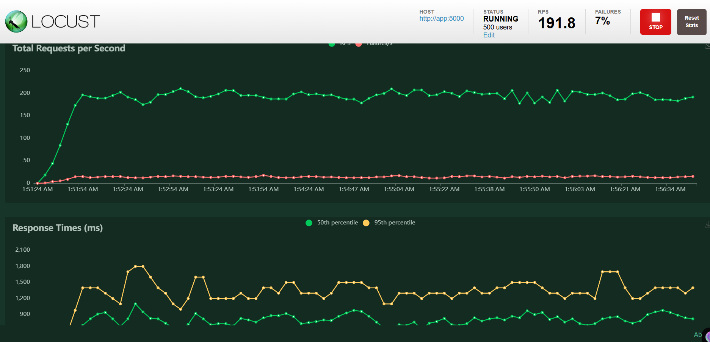
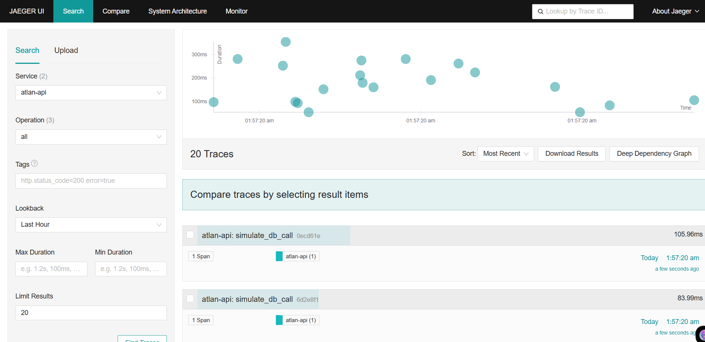

# **🧭 OmniTrace: End-to-End Observability Stack for API Monitoring**

<p align="center">
  
  
  
  
  
  
  
  
  
  
</p>

---

This project sets up a comprehensive observability solution for a REST API using a modern, open-source stack. It enables any engineer to **detect anomalies early**, **diagnose bottlenecks quickly**, and **make confident decisions** by providing unified visibility into **metrics**, **logs**, and **traces**.

## **💡 Problem Statement**

Atlan engineers were facing challenges with slow, manual, and inconsistent debugging of API regressions after releases. Root-causing issues was difficult, relying heavily on a few experts, and existing logs were often unhelpful.

The objective was to design and demonstrate an observability solution that allows any engineer to:

1. **Detect anomalies early** (degradation and failures).
2. **Diagnose bottlenecks and failure causes quickly** across the request path.
3. **Decide corrective actions confidently** with minimal back-and-forth.
4. **Democratize knowledge** via clear dashboards, baseline instrumentation, and repeatable patterns.

## **🧱 System Architecture**

OmniTracer centralizes the **three pillars of observability**:

- 📊 **Metrics** (Prometheus)
- 📜 **Logs** (Loki + Promtail)
- 🕵️ **Traces** (Jaeger + OpenTelemetry)

All orchestrated with **Docker Compose**, and visualized in **Grafana**.

### 🗺️ High-Level Architecture

<p align="center">
  
</p>


### Dashboard Preview

<p align="center">
  <table align="center">
    <tr>
      <td align="center">
        
        <br>
        <b>Grafana Dashboard</b>
      </td>
      <td align="center">
        
        <br>
        <b>Prometheus Dashboard</b>
      </td>
    </tr>
    <tr>
      <td align="center">
        
        <br>
        <b>Locust Dashboard</b>
      </td>
      <td align="center">
        
        <br>
        <b>Jaeger Dashboard</b>
      </td>
    </tr>
  </table>
</p>


### **Components Overview:**

- **App (Flask API)**: Sample API generating metrics, logs, and traces.
- **Locust**: Load testing, simulating real traffic.
- **OpenTelemetry Collector (OTel Collector)**: Collects traces, exports to Jaeger.
- **Jaeger (All-in-One)**: Distributed tracing system with waterfall views.
- **Prometheus**: Scrapes and stores metrics.
- **Loki** + **Promtail**: Log aggregation.
- **Alertmanager**: Routes alerts from Prometheus.
- **Grafana**: Unified dashboards for metrics, logs, and traces.

## **📁 Folder Structure**

The project is organized into a clear and logical folder structure to manage configurations and application code.

```text
.                                               # Project Root
├── README.md                                   # Project overview and instructions
├── docker-compose.yml                          # Orchestrates all services
├── app/                                        # Sample Python Flask API application
│   ├── Dockerfile.app                          # Dockerfile for building the app image
│   ├── main.py                                 # Flask application code with instrumentation
│   └── requirements.txt                        # Python dependencies for the app
├── grafana/                                    # Grafana configuration for provisioning
│   ├── dashboards/                             # Dashboard JSON files for auto-provisioning
│   │   └── sample_api_dashboard.json           # The main observability dashboard
│   └── datasources/                            # Data source YAML files for auto-provisioning
│       └── datasource.yml                      # Defines Prometheus, Loki, and Jaeger datasources
├── loki/                                       # Loki configuration
│   └── loki-config.yaml                        # Loki server configuration
├── prometheus/                                 # Prometheus configuration
│   ├── alert.rules.yml                         # Prometheus alerting rules
│   └── prometheus.yml                          # Prometheus server and scrape configuration
├── promtail/                                   # Promtail configuration
│   └── promtail-config.yaml                    # Promtail agent configuration to scrape logs
├── otel-collector/                             # OpenTelemetry Collector configuration
│   └── otel-collector-config.yaml              # OTel Collector pipeline configuration
├── alertmanager/                               # Alertmanager configuration
│   └── config.yml                              # Alertmanager routing and receiver configuration
└── locust/                                     # Locust load testing setup
    ├── Dockerfile.locust                       # Dockerfile for building the Locust image
    ├── locustfile.py                           # Locust test script defining user behavior
    └── requirements.txt                        # Python dependencies for Locust
```

## **🚀 Getting Started**

Follow these steps to deploy and run the entire observability stack on your local machine using Docker Compose.

### **Prerequisites**

- **Docker Desktop**: Ensure [Docker Desktop](https://www.docker.com/products/docker-desktop/) is installed and running on your system (Windows, macOS, or Linux).
- Ensure ports 3000, 9090, 9093, 8089, 16686, 5000 are free.

### **Installation and Deployment**

1. **Clone the Repository**:

```bash
git clone https://github.com/CodeWithDubeyji/OmniTracer.git
cd Grafana
```

2. Create Directory Structure and Files:  
   Ensure your project directory structure matches the one described above. Copy the provided code for each file into its respective location.
3. Deploy the Stack:  
    Navigate to the root directory of your project (where <span style="background-color: #f5f5f5; padding-left: 4px; padding-right: 4px; border-radius: 5px ">docker-compose.yml</span> is located) in your terminal and run the following command:
   <div style="background-color: #f5f5f5; padding: 15px; border-radius: 5px;" >docker compose down -v && docker compose up --build --force-recreate -d</div> <br>

   - docker compose down \-v: Stops and removes all existing containers, networks, and **volumes** from previous runs. This ensures a clean slate and prevents conflicts.
   - &&: Ensures the next command runs only if the previous one was successful.
   - docker compose up \--build \--force-recreate \-d:
     - up: Starts all services defined in docker-compose.yml.
     - \--build: Rebuilds Docker images for services with a build context (app and locust), ensuring any code changes are incorporated.
     - \--force-recreate: Forces containers to be recreated, applying all new configuration changes.
     - \-d: Runs the containers in **detached mode** (in the background).

Allow a minute or two for all services to fully initialize.

## **🧪 Generating Load and Exploring Data**

Once all services are running, you need to generate traffic to your API to see data flowing through the observability stack.

### **1\. Start Load Generation with Locust**

1. **Access Locust UI**: Open your web browser and go to: **http://localhost:8089**
2. **Configure and Start Swarm**:
   - In the Locust UI, enter:
     - **Number of users**: 50 (or higher, e.g., 100\)
     - **Spawn rate**: 10 users/sec (or higher, e.g., 20\)
     - **Host**: Ensure this is set to http://app:5000
   - Click the "**Start swarming**" button.
   - Locust will now continuously send requests to your API, simulating user activity and generating metrics, logs, and traces. You'll see real-time statistics (RPS, failures, response times) in the Locust UI.

### **2\. Explore Unified Dashboards in Grafana**

Grafana is your central visualization hub.

1. **Access Grafana**: Open your web browser and go to: **http://localhost:3000**
2. **Login**:
   - **Username**: admin
   - **Password**: admin (You may be prompted to change it on first login).
3. **Open the Dashboard**:
   - On the left sidebar, click the **Dashboards** icon (square grid).
   - Select **Browse**.
   - Open the "**Atlan API Observability (Enhanced)**" dashboard.
4. **Observe Data Flow**:
   - **Metrics Panels**: You will see "API Request Rate by Endpoint and Status" and "API Latency Percentiles" populated with real-time data from Prometheus.
   - **Application Logs**: The "Application Logs" panel will display streaming log entries from Loki.
   - **Application Traces**: The "Application Traces (Last 20)" panel will list recent traces from Jaeger.
5. **Adjust Time Range**: Ensure the **time range selector** (top-right corner, e.g., "Last 1 hour") is set to a period where Locust has been active (e.g., "Last 5 minutes") and click the **refresh icon** to ensure the latest data is displayed.

### **3\. Monitor Alerts with Prometheus and Alertmanager**

1. **Prometheus UI**: Go to **http://localhost:9090**
   - Click on the "**Alerts**" tab.
   - Your atlan-api-alerts group should show as **active**. If the load from Locust is sufficient to meet the defined thresholds (e.g., \>10% error rate, P99 latency \> 0.5s), the HighErrorRate or HighLatency alerts will transition to a FIRING state.
2. **Alertmanager UI**: Go to **http://localhost:9093**
   - This interface displays all alerts received from Prometheus. You can view their status, manage silences, and see inhibition rules.

### **4\. Dive into Traces with Jaeger UI**

For detailed trace analysis, use the dedicated Jaeger UI.

1. **Access Jaeger UI**: Open your web browser and go to: **http://localhost:16686**
2. **Find Traces**:
   - Select atlan-api from the "Service" dropdown.
   - Click "**Find Traces**".
   - You'll see a list of recent traces. Click on any trace ID to open its detailed waterfall diagram, which visualizes the duration of each span (e.g., the main API request, simulate_db_call). This is invaluable for pinpointing performance bottlenecks and understanding the flow of a request through your application.

## **⚙️ Component Explanations and Data Flow Pipeline**

This section provides a thorough explanation of each component and how data flows through the entire observability pipeline.

### **1\. Sample API Application (app)**

- **Technology**: Python Flask.
- **Purpose**: Simulates a REST API endpoint (/api/data) that performs internal operations (e.g., a simulated database call with time.sleep). It also includes a health check endpoint (/health).
- **Instrumentation**:
  - **Metrics**: Uses prometheus_client to expose RED-style metrics (http_requests_total for request count/status, http_request_duration_seconds for latency) on app:8000/metrics.
  - **Logs**: Configured with logging to output structured JSON logs to stdout.
  - **Traces**: Instrumented with opentelemetry-instrumentation-flask and opentelemetry-instrumentation-requests. It uses opentelemetry-sdk to generate distributed traces (spans) for each request and internal operations (e.g., simulate_db_call). These traces are exported via OTLP (OpenTelemetry Protocol) to the otel-collector.
- **Data Flow**:
  - **Metrics**: Prometheus scrapes app:8000/metrics.
  - **Logs**: Docker captures stdout/stderr logs, which Promtail then picks up.
  - **Traces**: app sends OTLP traces to otel-collector:4317.

### **2\. Locust (Load Generator)**

- **Technology**: Python.
- **Purpose**: To simulate a configurable number of users hitting the API endpoints (/api/data, /health). This generates continuous and realistic load, ensuring a steady stream of metrics, logs, and traces for the observability stack.
- **Configuration**: locustfile.py defines user behavior, including wait_time between tasks and @task decorators with weights to control the frequency of hitting different endpoints. The HOST environment variable points to the app service.
- **Data Flow**: Sends HTTP requests to app:5000.

### **3\. OpenTelemetry Collector (otel-collector)**

- **Technology**: Go (OpenTelemetry project).
- **Purpose**: Acts as an intermediary agent for telemetry data. It receives traces from the app service, processes them, and exports them to Jaeger. This decouples the application's instrumentation from the backend.
- **Configuration**: otel-collector-config.yaml defines:
  - **Receivers**: otlp (OpenTelemetry Protocol) to accept traces from app.
  - **Exporters**: otlp/jaeger to send traces to the jaeger service.
  - **Pipelines**: Connects the otlp receiver to the otlp/jaeger exporter for traces.
- **Data Flow**:
  - **Receives**: OTLP traces from app:4317.
  - **Exports**: OTLP traces to jaeger:4317.
- **Note**: This service does **not** expose any ports to the host machine, as it only communicates internally within the Docker network.

### **4\. Jaeger (jaeger \- All-in-One)**

- **Technology**: Go (Jaeger project).
- **Purpose**: A distributed tracing system that enables end-to-end visibility of requests across microservices. The all-in-one image combines the Jaeger Collector (receives traces), Query Service (provides UI), and Agent (local collector).
- **Configuration**: Environment variables (MEMORY_MAX_TRACES, COLLECTOR_OTLP_GRPC_PORT, COLLECTOR_OTLP_HTTP_PORT) configure it for in-memory storage and specify OTLP ingestion ports.
- **Data Flow**:
  - **Receives**: OTLP traces from otel-collector:4317.
  - **Stores**: Traces in its in-memory storage (for this demo).
  - **Exposes**: UI at http://localhost:16686 and OTLP/gRPC/HTTP ports for trace ingestion to the host.

### **5\. Prometheus**

- **Technology**: Go (Prometheus project).
- **Purpose**: A time-series database and monitoring system. It scrapes metrics from configured targets, stores them, and allows for powerful querying (PromQL) and alerting.
- **Configuration**: prometheus.yml defines:
  - **Scrape Jobs**: app job to scrape metrics from app:8000/metrics.
  - **Alerting**: Points to alertmanager:9093 for sending alerts and loads alert.rules.yml.
- **Data Flow**:
  - **Scrapes**: Metrics from app:8000/metrics.
  - **Stores**: Scraped metrics in prometheus_data volume.
  - **Sends**: Firing alerts to alertmanager:9093.

### **6\. Loki**

- **Technology**: Go (Grafana Labs).
- **Purpose**: A horizontally scalable, highly available, multi-tenant log aggregation system. It's designed to be very cost-effective by indexing only metadata (labels) rather than the full log content.
- **Configuration**: loki-config.yaml defines:
  - **Storage**: Uses boltdb-shipper and filesystem for local storage in loki_data volume.
  - **Schema**: Uses v11 schema.
  - **Ingester Lifecycle**: Configured for robust readiness.
- **Data Flow**:
  - **Receives**: Log streams from promtail:9080 (internally) on loki:3100/loki/api/v1/push.
  - **Stores**: Logs in loki_data volume.

### **7\. Promtail**

- **Technology**: Go (Grafana Labs).
- **Purpose**: An agent that collects logs from local filesystems and forwards them to Loki. It's configured to discover Docker container logs and attach relevant labels.
- **Configuration**: promtail-config.yaml defines:
  - **Client**: Points to loki:3100/loki/api/v1/push as the ingestion endpoint.
  - **Scrape Configs**: Uses docker_sd_configs to discover Docker containers.
  - **Relabel Configs**: Crucially, it extracts labels like container, job, instance, service from Docker metadata and filters to action: keep logs specifically from the grafana-app service.
- **Data Flow**:
  - **Reads**: Log files from /var/lib/docker/containers (mounted from the host).
  - **Sends**: Labeled log streams to loki:3100/loki/api/v1/push.

### **8\. Alertmanager**

- **Technology**: Go (Prometheus project).
- **Purpose**: Handles alerts sent by client applications (like Prometheus). It deduplicates, groups, and routes them to the correct receiver. It also manages silencing and inhibition of alerts.
- **Configuration**: config.yml defines basic routing and a default-receiver. For this demo, it primarily logs alerts, but in a production setup, it would integrate with email, Slack, PagerDuty, etc.
- **Data Flow**:
  - **Receives**: Alerts from prometheus:9093.
  - **Stores**: State in alertmanager_data volume.
  - **Routes**: Alerts to configured receivers.

### **9\. Grafana**

- **Technology**: Go (Grafana Labs).
- **Purpose**: The primary visualization tool. It queries data from Prometheus (metrics), Loki (logs), and Jaeger (traces) and displays them in interactive, unified dashboards.
- **Configuration**: grafana/datasources/datasource.yml and grafana/dashboards/sample_api_dashboard.json are used for automatic provisioning:
  - **Data Sources**: Configures connections to Prometheus, Loki, and Jaeger.
  - **Dashboards**: Loads the pre-defined "Atlan API Observability (Enhanced)" dashboard.
- **Data Flow**:
  - **Queries**: Prometheus for metrics, Loki for logs, Jaeger for traces.
  - **Displays**: Unified view on http://localhost:3000.

## 📖 Design Decisions & Trade-offs

OmniTracer was designed not only as a working demo but also as a **blueprint for modern observability**.  
Below is a summary of the design rationale, requirements addressed, and trade-offs made.

---

### ✅ Requirements Addressed

- **Scenario Focus** → Single REST API with simulated dependencies (DB, API calls).
- **Metrics (RED/USE style)** → Request rate, error %, latency percentiles collected via Prometheus.
- **Logging Strategy** → Structured JSON logs with `trace_id` + `span_id` for correlation, shipped by Promtail to Loki.
- **Dashboard** → Unified Grafana dashboards for detection, diagnosis, and decisions.
- **Alerting & Tracing** → Prometheus + Alertmanager for alerts; OpenTelemetry + Jaeger for distributed tracing.
- **Extensibility** → Modular Docker Compose stack; new services can be instrumented easily.
- **Impact Tracking** → Enables tracking of MTTD, MTTR, alert false-positives, and resolution rates.
- **Future Risks Considered** → Alert fatigue, noisy logs, data costs — mitigations discussed in design.

---

### 🛠 Key Tooling Decisions

- **Prometheus** → Chosen for robust metrics + PromQL. _(Trade-off: pull model not ideal for ephemeral jobs)._
- **Loki** → Cost-effective, label-based logging tightly integrated with Grafana. _(Trade-off: not full-text indexed)._
- **Jaeger** → Powerful tracing with waterfall UI. _(Trade-off: demo uses in-memory storage, not production-grade)._
- **Grafana** → Unified visualization across metrics, logs, and traces. _(Trade-off: requires provisioning configs)._
- **OTel Collector** → Vendor-agnostic trace pipeline, future-proof. _(Trade-off: extra component complexity)._
- **Promtail** → Docker-native log scraping. _(Trade-off: tightly coupled with Loki)._
- **Alertmanager** → Decoupled alert routing. _(Trade-off: demo lacks Slack/PagerDuty integration)._
- **Locust** → Realistic load testing. _(Trade-off: requires Python scripts for behavior)._

---

### 🎯 Proof of Effectiveness

- **Faster Detection (↓ MTTD)** → Alerts + dashboards show spikes in error rate/latency instantly.
- **Faster Diagnosis (↓ MTTR)** → Metrics → Logs → Traces correlation in one Grafana view.
- **Self-Serve Resolution** → Engineers no longer depend solely on experts; dashboard democratizes insights.
- **Coverage** → Critical-path endpoints instrumented; template extensible to others.
- **Quality** → Alerts designed on robust metrics reduce noise & false positives.

---

### ⚠️ Known Gaps (Acceptable for Demo Scope)

- **Jaeger storage** → In-memory only (would need Cassandra/Elasticsearch in prod).
- **Alertmanager** → Logs alerts locally, no Slack/PagerDuty integration.
- **Scaling/HA** → Single-instance Docker Compose; production would use Kubernetes.
- **Security** → Demo creds (`admin/admin`), no TLS/auth.
- **Retention** → Default storage; no cost-optimized policies.
- **Advanced Logging** → No PII masking, sampling, or client-side enrichment.

---

### 🔮 Future Roadmap

While OmniTrace is currently a **demo-grade observability stack**, the following enhancements can make it production-ready:

- ✅ Persistent storage for Jaeger traces (Cassandra/Elasticsearch).
- ✅ Alertmanager integrations (Slack, PagerDuty, Email).
- ✅ High availability deployments on Kubernetes.
- ✅ Secure credentials & TLS-based communication.
- ✅ Advanced log processing (PII masking, sampling strategies).

---

### 🤝 Contributing

Contributions are welcome! 🎉  
If you’d like to improve dashboards, add integrations, or optimize configurations:

1. Fork this repo
2. Create a feature branch (`git checkout -b feature/my-feature`)
3. Commit your changes and open a Pull Request

---

⭐ If this project helped you, consider giving it a **star** on GitHub to support its growth!
